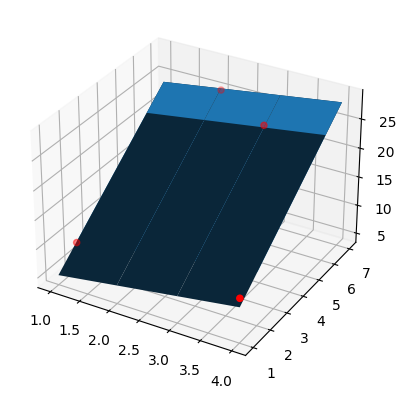

# Simple and Multiple Linear Regression

This repository displays simple and multiple linear regression. Simple linear regression is where there is a single feature (X has 1 column).
Multiple linear regression is where there are multiple features (X has more than 1 column).
The image below shows a graph for simple linear regression.

The image below shows a graph for multiple linear regression.

The image below shows the logistic regression neural network.
)
